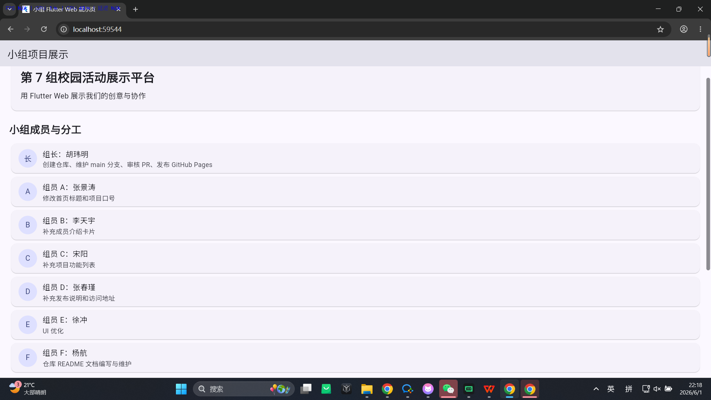
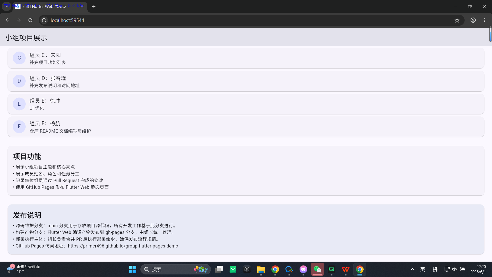

# 第 7 组校园活动展示平台


用 Flutter Web 展示我们的创意与协作

---

## 项目简介

本项目是一个基于 **Flutter Web** 的小组协作展示平台，旨在展示第 7 组的校园活动主题、团队成员信息、任务分工以及项目核心功能。通过 GitHub Pages 实现静态页面部署，为小组提供一个在线展示和协作管理的平台。

### 项目目标

- 建立一个美观、专业的小组展示页面
- 清晰展示团队成员及其职责分工
- 记录团队协作过程和成果
- 提供便捷的访问方式（GitHub Pages）

---

## 运行截图





---

## 技术栈

| 分类 | 技术 | 版本 |
| :--- | :--- | :--- |
| 框架 | Flutter | 3.x |
| 语言 | Dart | 3.x |
| UI 设计 | Material Design | 3 |
| 部署平台 | GitHub Pages | - |

---

## 项目结构

```
├── android/              # Android 平台配置（自动生成）
├── build/                # 构建产物目录
│   └── web/              # Web 构建输出
├── screenshots/          # 运行截图目录
│   ├── screenshot-1.png  # 运行效果截图 1
│   └── screenshot-2.png  # 运行效果截图 2
├── lib/                  # Dart 源代码目录
│   └── main.dart         # 主应用入口
├── test/                 # 测试文件目录
├── web/                  # Web 入口文件
│   ├── index.html        # HTML 入口
│   └── manifest.json     # Web 应用配置
├── .gitignore            # Git 忽略配置
├── analysis_options.yaml # Dart 分析配置
├── pubspec.yaml          # 项目依赖配置
└── README.md             # 项目说明文档
```

---

## 小组成员

| 角色 | 姓名 | 任务分工 |
| :--- | :--- | :--- |
| **组长** | 胡玮明 | 创建仓库、维护 main 分支、审核 PR、发布 GitHub Pages |
| 组员 A | 张景涛 | 修改首页标题和项目口号 |
| 组员 B | 李天宇 | 补充成员介绍卡片 |
| 组员 C | 宋阳 | 补充项目功能列表 |
| 组员 D | 张春瑾 | 补充发布说明和访问地址 |
| 组员 E | 徐冲 | UI 优化 |
| 组员 F | 杨航 | 仓库 README 文档编写与维护 |

---

## 项目功能

### 核心功能

- ✅ **项目主题展示**：展示小组项目标题和核心口号
- ✅ **成员信息展示**：展示所有组员的角色、姓名和任务分工
- ✅ **功能特性列表**：展示项目的核心功能亮点
- ✅ **发布说明**：提供部署方式和访问地址信息

### 技术特性

- 🎨 **Material Design 3**：采用最新的 Material Design 设计规范
- 📱 **响应式布局**：适配多种屏幕尺寸
- 🌐 **Web 部署**：通过 GitHub Pages 实现在线访问
- 🚀 **快速构建**：Flutter Web 一键构建

---

## 快速开始

### 环境要求

- Flutter 3.10.0 或更高版本
- Dart 3.0.0 或更高版本
- Chrome 浏览器（推荐用于 Web 开发）

### 本地运行

```bash
# 1. 克隆仓库
git clone https://github.com/primer496/group-flutter-pages-demo.git

# 2. 进入项目目录
cd group-flutter-pages-demo

# 3. 安装依赖
flutter pub get

# 4. 运行项目（默认设备）
flutter run

# 5. 使用 Chrome 浏览器运行
flutter run -d chrome
```

### 构建 Web 静态文件

```bash
# 构建生产版本
flutter build web --base-href /group-flutter-pages-demo/

# 构建完成后，产物位于以下目录
# build/web/
```

### 预览构建结果

```bash
# 使用 Python 启动本地服务器预览
cd build/web
python -m http.server 8000

# 访问 http://localhost:8000 查看效果
```

---

## 部署说明

### 分支管理策略

| 分支名称 | 用途 | 管理权限 |
| :--- | :--- | :--- |
| `main` | 存放项目源代码，所有开发工作基于此分支 | 全体组员 |
| `gh-pages` | 存放 Flutter Web 编译产物，用于 GitHub Pages 部署 | 组长 |

### 部署流程

1. **组长执行构建**：
   ```bash
   flutter build web --base-href /group-flutter-pages-demo/
   ```

2. **部署到 gh-pages 分支**（使用 gh-pages 工具或手动部署）

3. **配置 GitHub Pages**：
   - 进入仓库 Settings → Pages
   - 选择 `gh-pages` 分支作为源
   - 保存配置

### 访问地址

**GitHub Pages 在线访问**：  
[https://primer496.github.io/group-flutter-pages-demo](https://primer496.github.io/group-flutter-pages-demo)

---

## 协作流程

### Git 工作流

```
main (主分支)
    ↓
feature/xxx (个人开发分支)
    ↓
Pull Request → 审核 → 合并 → 部署
```

### 协作步骤

1. **创建开发分支**：
   ```bash
   git checkout -b feature/your-feature-name
   ```

2. **提交代码**：
   ```bash
   git add .
   git commit -m "feat: 描述你的修改内容"
   ```

3. **推送分支**：
   ```bash
   git push origin feature/your-feature-name
   ```

4. **发起 Pull Request**：
   - 访问 GitHub 仓库
   - 点击 "Compare & pull request"
   - 填写 PR 描述并提交

5. **审核与合并**：
   - 组长审核代码
   - 通过后合并到 `main` 分支

---

## 开发规范

### 代码风格

- 遵循 [Flutter 官方代码风格指南](https://docs.flutter.dev/development/tools/style-guide)
- 使用 `dart format` 自动格式化代码
- 使用 `flutter analyze` 检查代码质量

### Commit 信息规范

```
<类型>(<范围>): <描述>

[可选的详细说明]
```

**类型说明**：
- `feat`: 新功能
- `fix`: 修复 bug
- `docs`: 文档更新
- `style`: 代码格式调整
- `refactor`: 代码重构
- `test`: 测试相关

**示例**：
```
feat(members): 添加成员介绍卡片组件
fix(ui): 修复标题样式问题
docs(readme): 更新部署说明
```

### PR 提交规范

- PR 标题清晰描述修改内容
- 包含修改前后的对比截图（如涉及 UI 变更）
- 关联相关 Issue（如有）
- 确保 CI 检查通过

---

## 贡献指南

欢迎各位组员贡献代码！请遵循以下步骤：

1. Fork 本仓库（如需）
2. 创建功能分支
3. 完成修改并提交
4. 发起 Pull Request
5. 等待审核合并

---

## 许可证

MIT License

---

## 联系方式

如有问题或建议，请通过以下方式联系：

- 仓库地址：[https://github.com/primer496/group-flutter-pages-demo](https://github.com/primer496/group-flutter-pages-demo)
- 组长：胡玮明